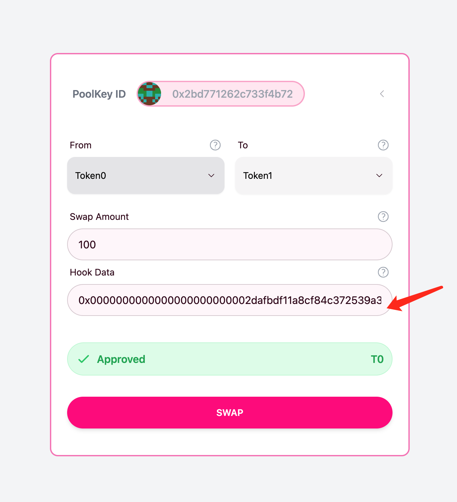

# An Off-chain Orderbook for Uniswap Pools

## Description

An Uniswap Pre-Swap Hook to provide the Orderbook funtionality for Uniswap pools. MEV protection guaranteed, no more Slipepage, no more trading fee, without necessity to swap inside AMM pool.

## Why it Matters

- People are struggling with the slipage, espaecally at poor liquidity pool
- People got sandwich attack even with a proper slipage tolerance setting
- Trading fee is expensive especially swap with high quantity

## Solution

Instead of swapping though pool directly, each time when traders submit their trading transaction, we will first look up the off-chain orderbook to check if there have counterpart orders. If have, we will swap between order provider and trader's request automatically on pre-swap hook contract, or we fallback to AMM pool.
- [Hook contract](./contracts/src/OrderBook.sol)
- [Orderbook Utilities](./scripts/console.js)

## How it works

- We define people who trades on Uniswap as Traders, people who submit their order to off-chain orderbook as Order Providers

- An off-chain orderbook implemented in Phat Contract, in this Hackathon, we simulate with JavaScript, and an simple orderbook described and maintained manually in a [JSON file](./scripts/orderbook.json)

- Order provider submit their order though Phat contract query, which underlying being saved in phat contract's cache without any delay and fee required.

- When Trader swap in this pool, we check the orderbook to see if there are orders can match the trading requirement.
    - If exist, we construct the automatic swap transaction data (e.g. hook data below) and pass it to the pre-swap hook contract, inside the pre-swap hook function, we exchange assets for provider and traders with ERC20 `transferFrom` function, then return NoOp so the uniswap swap operation will be skipped; For example, with the following command, we calculated the hook data that can be specificed when doing swap  on the UI
    ```sh
    node scripts/console.js orderbook search --spender 0xf39Fd6e51aad88F6F4ce6aB8827279cffFb92266 --spend token0 --amount 100 

    start building Hookdata...
    {
    "token0PermitTarget": "0x2dafbdf11a8cf84c372539a38d781d8248399ae3",
    "token0PermitCalldata": "0xd505accf000000000000000000000000f39fd6e51aad88f6f4ce6ab8827279cfffb92266000000000000000000000000330ae74daa74d90fac17045ebba5ba7d233f69d90000000000000000000000000000000000000000000000000000000000000064ffffffffffffffffffffffffffffffffffffffffffffffffffffffffffffffff000000000000000000000000000000000000000000000000000000000000001cfde0d0a5c261c4e3aadc4c384cbd5d8a92cf51eb94cef0403fbf271b1bb57dac17bc057b2931b1b4dfdc8bb16ee86ca59abfc5edc3fec45cc5005eedc3ee4c3b",
    "token1PermitTarget": "0xa8ceafb1940244f2f022ff8440a42411b4f07fc4",
    "token1PermitCalldata": "0xd505accf00000000000000000000000070997970c51812dc3a010c7d01b50e0d17dc79c8000000000000000000000000330ae74daa74d90fac17045ebba5ba7d233f69d900000000000000000000000000000000000000000000000000000000000003e8ffffffffffffffffffffffffffffffffffffffffffffffffffffffffffffffff000000000000000000000000000000000000000000000000000000000000001b02da4db245b36182ee5e770e34f96e87120cf34ce0db7555c369bd36a3fde889393ab63c41c0a60417109d78493a182778133cb7dd609d7b358110c3ff26beb1",
    "token0Amount": "100",
    "token1Amount": 1000,
    "provider": "0x70997970C51812dc3A010C7d01b50e0d17dc79C8"
    }
    🎉 Found matched buying order, following hookdata to swap function:
    0x0000000000000000000000002dafbdf11a8cf84c372539a38d781d8248399ae300000000000000000000000000000000000000000000000000000000000000e0000000000000000000000000a8ceafb1940244f2f022ff8440a42411b4f07fc40000000000000000000000000000000000000000000000000000000000000200000000000000000000000000000000000000000000000000000000000000006400000000000000000000000000000000000000000000000000000000000003e800000000000000000000000070997970c51812dc3a010c7d01b50e0d17dc79c800000000000000000000000000000000000000000000000000000000000000e4d505accf000000000000000000000000f39fd6e51aad88f6f4ce6ab8827279cfffb92266000000000000000000000000330ae74daa74d90fac17045ebba5ba7d233f69d90000000000000000000000000000000000000000000000000000000000000064ffffffffffffffffffffffffffffffffffffffffffffffffffffffffffffffff000000000000000000000000000000000000000000000000000000000000001cfde0d0a5c261c4e3aadc4c384cbd5d8a92cf51eb94cef0403fbf271b1bb57dac17bc057b2931b1b4dfdc8bb16ee86ca59abfc5edc3fec45cc5005eedc3ee4c3b0000000000000000000000000000000000000000000000000000000000000000000000000000000000000000000000000000000000000000000000e4d505accf00000000000000000000000070997970c51812dc3a010c7d01b50e0d17dc79c8000000000000000000000000330ae74daa74d90fac17045ebba5ba7d233f69d900000000000000000000000000000000000000000000000000000000000003e8ffffffffffffffffffffffffffffffffffffffffffffffffffffffffffffffff000000000000000000000000000000000000000000000000000000000000001b02da4db245b36182ee5e770e34f96e87120cf34ce0db7555c369bd36a3fde889393ab63c41c0a60417109d78493a182778133cb7dd609d7b358110c3ff26beb100000000000000000000000000000000000000000000000000000000
    ```

    then we pass the hook data to swap function:

    

    - If not exist, we pass empty argument to pre-swap hook function, thus, nothing will happen in the pre-swap hook, which eventually will fallback to the uniswap swap function, traders get their token from on-chain pool.
